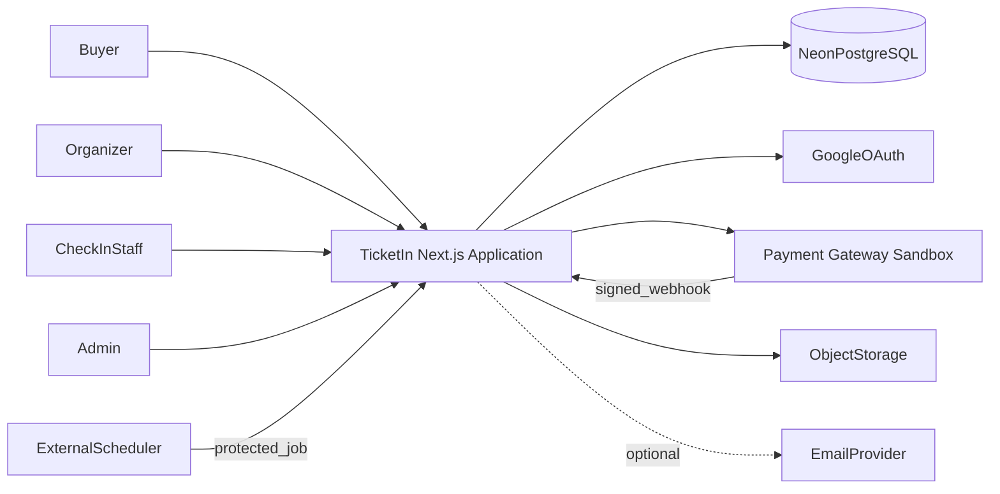
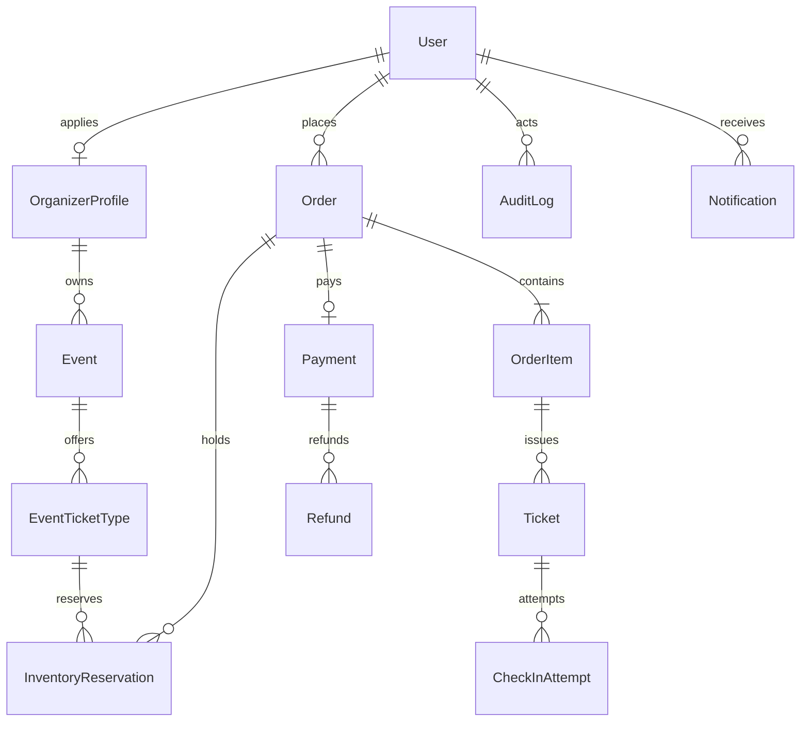
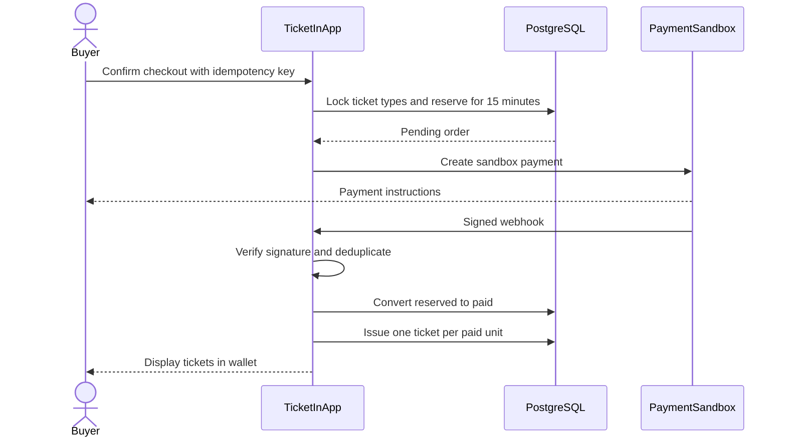
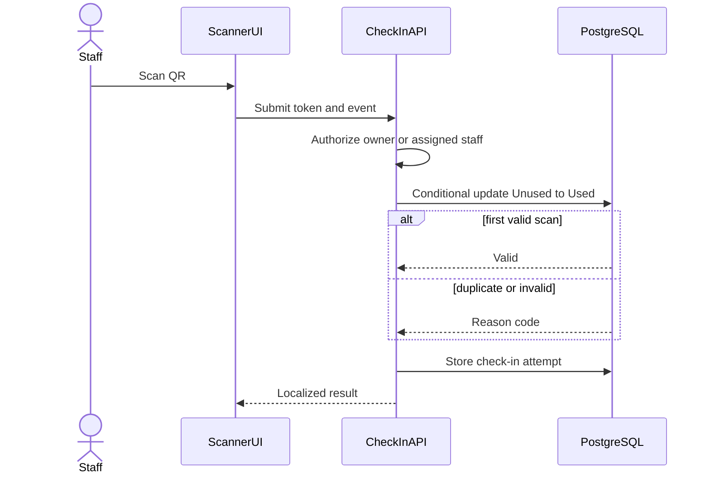
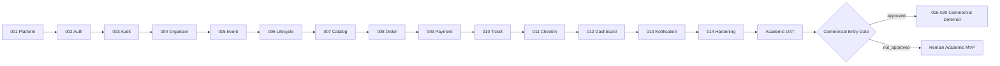

# TicketIn — Architecture Essentials

Dokumen ini adalah ringkasan praktis dari `architecture.md`, `prd-improved.md`, `features.md`, `RULES.md`, dan rangkaian RFC. Gunakan untuk orientasi cepat; gunakan dokumen sumber dan RFC aktif untuk detail implementasi.

## 1. Ringkasan Sistem

TicketIn adalah aplikasi web tiket event tatap muka untuk:

- **Pembeli:** menemukan event, checkout, membayar, dan menggunakan tiket.
- **Organizer:** membuat event, mengatur tiket, serta memantau penjualan.
- **Petugas:** memvalidasi tiket di venue.
- **Admin:** memoderasi dan menangani operasi platform.

Status proyek:

- **Saat ini:** prototype autentikasi.
- **Target aktif:** MVP akademik dengan payment sandbox dan data uji.
- **Deployment:** belum tersedia; provider non-Vercel masih TBD.
- **Rencana aktif:** RFC-001–RFC-014, lalu UAT akademik.
- **Rencana komersial:** RFC-015–RFC-020 berstatus **Deferred**.

## 2. Keputusan Arsitektur

Gunakan **modular monolith berbasis domain** dalam satu aplikasi Next.js.

Alasan utama:

- Sesuai untuk satu engineer dan horizon 12 minggu.
- Memungkinkan transaksi PostgreSQL yang kuat.
- Lebih mudah diuji, di-deploy, dan dioperasikan dibanding microservices.
- Boundary module tetap memungkinkan ekstraksi service di masa depan.

Prinsip dependensi:

```text
Presentation → Application Service → Domain → Ports
                                           ↑
                       Repository/Provider Adapters
```

Aturan:

1. UI, Server Action, dan Route Handler harus tipis.
2. Aturan bisnis berada pada application/domain service.
3. Domain tidak mengimpor React, Next.js, Prisma, atau SDK provider.
4. PostgreSQL adalah satu-satunya source of truth.
5. Integrasi eksternal selalu melalui port/adapter.
6. Invariant transaksi dijaga pada database.

## 3. Konteks Sistem



Seluruh sistem eksternal adalah trust boundary. Input dari browser, OAuth, webhook, scheduler, dan provider harus diotentikasi atau divalidasi.

## 4. Komponen dan Module

| Module | Tanggung Jawab |
|---|---|
| `platform` | Environment, database client, error, logger, health, locale |
| `auth` | Registrasi, login, OAuth, session, RBAC |
| `audit` | Audit log append-only dan event analytics |
| `organizers` | Profil organizer dan moderasi |
| `events` | Event authoring, ticket type, lifecycle, dan staff |
| `catalog` | Daftar, pencarian, filter, dan detail event |
| `inventory` | Availability counter dan reservation release |
| `orders` | Checkout, snapshot item, idempotensi, dan expiry |
| `payments` | Payment adapter, webhook inbox, dan rekonsiliasi |
| `refunds` | Refund sandbox |
| `tickets` | Ticket issuance, QR, dan buyer wallet |
| `check-in` | Scanner, validasi, dan attempt log |
| `reporting` | Dashboard dan ekspor |
| `notifications` | In-app, email opsional, dan reminder |

Struktur target:

```text
app/
  (public)/
  (buyer)/
  organizer/
  admin/
  api/
components/
  ui/
  shared/
modules/
  auth/
  audit/
  organizers/
  events/
  catalog/
  inventory/
  orders/
  payments/
  refunds/
  tickets/
  check-in/
  reporting/
  notifications/
lib/
  db/
  env/
  errors/
  logger/
  security/
prisma/
  schema.prisma
  migrations/
tests/
  integration/
  e2e/
```

## 5. Tech Stack Target

| Area | Teknologi |
|---|---|
| Runtime | Node.js 24.20.0 LTS |
| Framework | Next.js 16.3.4, App Router |
| UI | React 19.2.8 |
| Bahasa | TypeScript 7.0.2 strict |
| Styling | Tailwind CSS 4.3.3 |
| Database | PostgreSQL pada Neon |
| ORM | Prisma 7.10.0 |
| Auth | NextAuth 4.24.15 |
| Validation | Zod 4.5.4 |
| QR | `qrcode` dan `@zxing/browser` |
| Logging | Pino |
| Testing | Vitest dan Playwright |
| Deployment | Provider non-Vercel, TBD pada RFC-001 |

Repository masih menggunakan stack prototype. Major upgrade hanya dilakukan melalui RFC-001 dan tidak boleh digabung dengan fitur domain.

## 6. Model Data Inti



Invariant yang tidak boleh dilanggar:

1. `paidQuantity + reservedQuantity <= quota`.
2. Counter inventori tidak boleh negatif.
3. Satu external payment reference hanya untuk satu Payment.
4. Satu webhook provider diproses efektif satu kali.
5. Satu unit order Paid menghasilkan tepat satu Ticket.
6. Satu Ticket memiliki paling banyak satu check-in berhasil.
7. Event Cancelled tidak kembali Published.
8. Organizer hanya mengakses event dan peserta miliknya.

Konvensi data:

- ID menggunakan CUID/UUID.
- Nominal menggunakan integer Rupiah.
- Waktu disimpan sebagai UTC/`TIMESTAMPTZ`.
- OrderItem menyimpan snapshot nama dan harga.
- Reservation terpisah dari Ticket.
- Skema berubah hanya melalui migration.
- Transaksi, ticket, audit, dan check-in tidak di-hard-delete.

## 7. Alur Transaksi Utama



Lock order wajib:

1. Lock Order.
2. Lock TicketType berdasarkan ID ascending.
3. Validasi status dan waktu expiry.
4. Ubah counter inventori.
5. Ubah Order dan Payment.
6. Terbitkan Ticket.
7. Simpan audit/outbox dalam transaksi yang sama.

Webhook sukses setelah order Expired masuk antrean rekonsiliasi dan tidak menerbitkan tiket otomatis.

## 8. Alur Check-in



QR tidak memuat PII. Token direkomendasikan 256-bit, divalidasi pada server, dan tidak boleh dicatat pada log.

## 9. State dan Caching

| Jenis State | Source of Truth |
|---|---|
| Search/filter/page | URL |
| Form sementara | React local state |
| Session | NextAuth server session |
| Event/order/payment/ticket | PostgreSQL |
| Inventory | PostgreSQL transaction |
| Camera/scanner UI | Client Component |

- Katalog Published boleh menggunakan bounded revalidation.
- Perubahan event harus menginvalidasi cache.
- Inventory, order, payment, refund, dan check-in tidak boleh bergantung pada cache.
- QR/ticket page tidak boleh menggunakan public cache.
- Optimistic update dilarang untuk operasi finansial dan check-in.

## 10. API Essentials

- Validasi seluruh boundary dengan Zod.
- Periksa session, role, capability, dan ownership pada server.
- Gunakan pagination untuk daftar yang dapat bertambah.
- Gunakan idempotency key pada checkout, webhook, dan operasi sensitif.
- Jangan mempercayai harga, role, status, atau ownership dari client.

Format error:

```json
{
  "error": {
    "code": "INVENTORY_UNAVAILABLE",
    "message": "Jumlah tiket yang tersedia tidak mencukupi.",
    "correlationId": "req_...",
    "fieldErrors": {}
  }
}
```

## 11. Keamanan yang Tidak Dapat Ditawar

- Tidak ada hardcoded secret atau fallback secret.
- Password menggunakan asynchronous adaptive hashing.
- Dangerous automatic OAuth account linking dilarang.
- RBAC dan object-level authorization diterapkan server-side.
- Rate limit untuk auth, checkout, webhook, scanner, dan reset password.
- Webhook harus memverifikasi signature.
- QR token tidak boleh berisi PII atau muncul pada log.
- Audit wajib untuk moderasi, payment, refund, dan check-in.
- Credential production dilarang pada MVP akademik.
- Gunakan data uji sampai Commercial Entry Gate disetujui.

## 12. Deployment Essentials

TicketIn belum di-deploy. Provider harus non-Vercel dan dipilih pada RFC-001.

Provider wajib mendukung:

- Node.js 24 dan Next.js SSR/Route Handler.
- HTTPS, domain, OAuth callback, dan webhook publik.
- Secret terenkripsi serta environment terpisah.
- Health check, log, metric, migration step, dan rollback.
- Konektivitas aman ke Neon.
- Scheduler bawaan atau integrasi scheduler eksternal.

Lingkungan:

1. **Development:** seed eksplisit dan fake/sandbox.
2. **Preview/Test:** integration, E2E, load test, dan UAT.
3. **Production Demo:** data uji terkontrol dan payment sandbox.

Jika memakai VPS/container, tim mengelola TLS, reverse proxy, firewall, patching, process supervision, dan monitoring host.

## 13. Kinerja dan Reliability

Profil uji MVP:

- 5.000 tiket per event.
- 50 checkout bersamaan.
- 10 scanner bersamaan.
- Load test 15 menit.

Target:

- Katalog/detail p95 ≤ 2 detik.
- Check-in p95 ≤ 1,5 detik.
- Overselling = 0.
- Check-in berhasil ganda = 0.
- Backup RPO baseline 24 jam dan restore drill sebelum rilis.

Runtime aplikasi stateless; seluruh state transaksi berada di PostgreSQL. Expiry diproses batch dengan lock yang aman dan job idempoten.

## 14. Observability

Log terstruktur memuat:

- Timestamp, level, correlation ID.
- Module, operation, outcome, dan duration.
- Reason code untuk kegagalan penting.

Pantau:

- Error rate.
- Webhook invalid/duplikat/terlambat.
- Expiry job gagal.
- Konflik reservasi.
- Latensi check-in.
- Rejected check-in.
- Kesehatan aplikasi dan database.

Jangan mencatat password, cookie, OAuth token, QR token, connection string, atau PII yang tidak diperlukan.

## 15. Urutan Implementasi



- RFC-001–014 adalah jalur aktif.
- RFC-015–020 adalah rancangan komersial **Deferred**.
- Prompt komersial tidak boleh dijalankan sebelum Commercial Entry Gate.

## 16. Decision Gates

| Waktu | Keputusan |
|---|---|
| RFC-001 | Hosting non-Vercel, strategi data prototype, compatibility upgrade |
| RFC-005 | Object storage atau placeholder |
| RFC-008 | Scheduler/cron |
| RFC-009 | Payment gateway sandbox |
| RFC-013 | Email provider atau in-app-only |
| Sebelum RFC-015 | Strategi komersial, legal/finance/security owner, anggaran, timeline |
| RFC-020 | Live credential, progressive rollout, rollback, dan Commercial GA |

## 17. Definition of Done Arsitektural

Satu fitur selesai jika:

1. Acceptance criteria dan ID fitur terpenuhi.
2. Boundary module serta dependency direction dipatuhi.
3. Authorization, validation, error, logging, dan edge case ditangani.
4. Test unit/integration/E2E yang relevan lulus.
5. Invariant database tetap terjaga.
6. Tidak ada TODO, placeholder, secret, atau debug code.
7. Dokumentasi dan migration diperbarui.
8. Perubahan dapat di-deploy dan di-rollback.

## 18. Referensi

- `architecture.md` — arsitektur lengkap.
- `prd-improved.md` — kebutuhan produk utama.
- `features.md` — fitur, MoSCoW, acceptance criteria, dan dependensi.
- `RULES.md` — aturan pengembangan.
- `RFC/RFCS.md` — urutan dan dependency RFC.
- `RFC/RFC-001.md`–`RFC/RFC-014.md` — RFC aktif MVP.
- `RFC/RFC-015.md`–`RFC/RFC-020.md` — RFC komersial Deferred.
