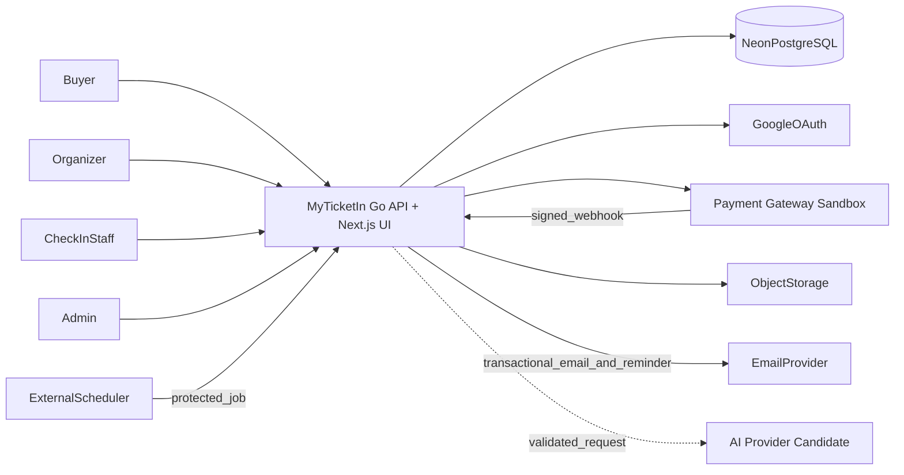
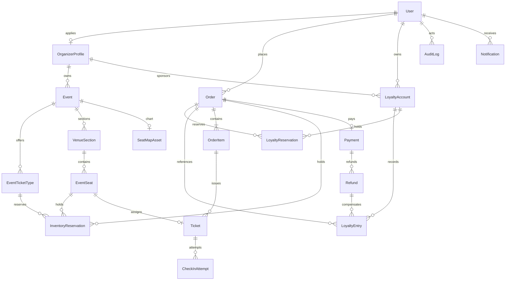
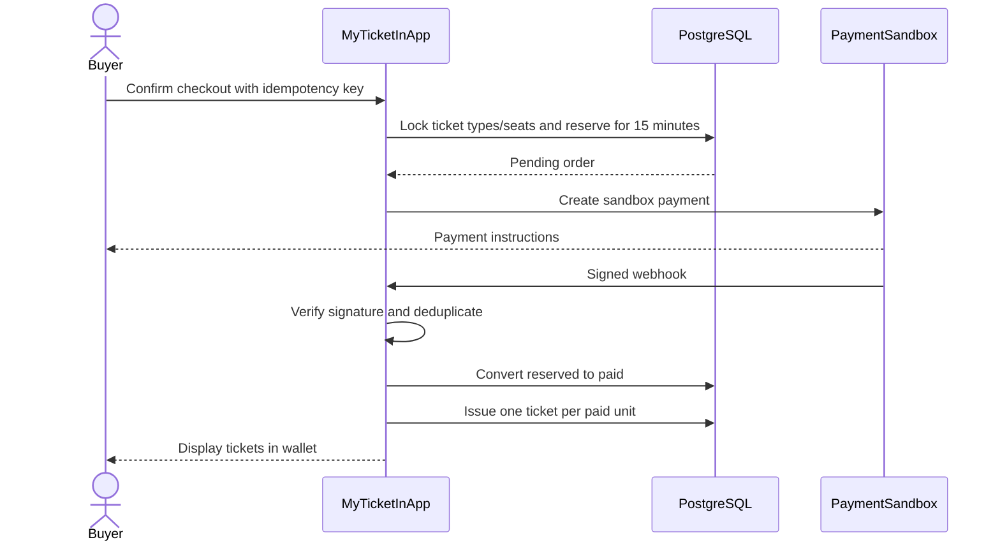
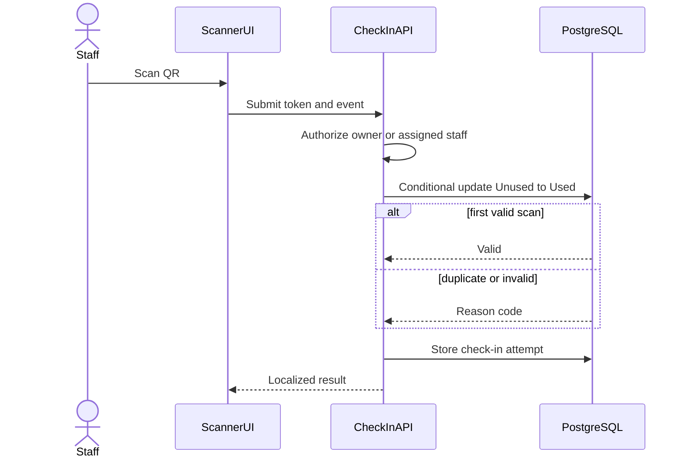

# MyTicketIn — Architecture Essentials

Dokumen ini adalah ringkasan praktis dari `architecture.md`, `prd-improved.md`, `features.md`, `RULES.md`, dan rangkaian RFC. Gunakan untuk orientasi cepat; gunakan dokumen sumber dan RFC aktif untuk detail implementasi.

## 1. Ringkasan Sistem

MyTicketIn adalah aplikasi web tiket event tatap muka untuk:

- **Pembeli:** menemukan event, memilih tiket atau kursi, checkout, membayar, dan menggunakan tiket.
- **Organizer:** membuat event, mengatur mode inventori, denah statis, serta memantau penjualan.
- **Petugas:** memvalidasi tiket di venue.
- **Admin:** memoderasi dan menangani operasi platform.

Status proyek:

- **Saat ini:** prototype autentikasi.
- **Target aktif:** MVP akademik dengan payment sandbox dan data uji.
- **Cakupan aktif:** 66 dari 77 fitur (57 Must, 5 Should, 4 Could, 11 Won’t).
- **Promosi Must:** F20, F46, F50, F51, dan F65; F49 tetap Must.
- **Deployment:** belum tersedia; provider non-Vercel masih TBD.
- **Rencana aktif:** RFC-001–RFC-014, lalu UAT akademik.
- **Rencana komersial:** RFC-015–RFC-020 berstatus **Deferred**.

## 2. Keputusan Arsitektur

Gunakan **modular monolith berbasis domain**: satu binary Go (API/job) plus Next.js sebagai UI.

Alasan utama:

- Sesuai untuk satu engineer dan horizon 12 minggu.
- Memungkinkan transaksi PostgreSQL yang kuat.
- Lebih mudah diuji, di-deploy, dan dioperasikan dibanding microservices.
- Boundary module tetap memungkinkan ekstraksi service di masa depan.

Prinsip dependensi:

```text
Presentation → Application Service → Domain → Ports
                                           ↑
                       Repository/Provider Adapters
```

Aturan:

1. UI, Server Action, dan Route Handler harus tipis.
2. Aturan bisnis berada pada application/domain service.
3. Domain tidak mengimpor chi, pgx, React, Next.js, atau SDK provider.
4. PostgreSQL adalah satu-satunya source of truth.
5. Integrasi eksternal selalu melalui port/adapter.
6. Invariant transaksi dijaga pada database.
7. AI hanya memberi usulan terstruktur yang harus melewati validasi deterministik; F76 juga wajib ditinjau manusia.
8. Loyalty points terisolasi per buyer–organizer, tidak bernilai tunai, dan hanya berlaku pada sandbox.

## 3. Konteks Sistem



Seluruh sistem eksternal adalah trust boundary. Input dari browser, OAuth, webhook, scheduler, dan provider harus diotentikasi atau divalidasi. Output AI selalu dianggap tidak tepercaya dan hanya boleh menjadi DTO schema-versioned yang dinormalisasi serta divalidasi.

## 4. Komponen dan Module

| Module | Tanggung Jawab |
|---|---|
| `platform` | Environment, database client, error, logger, health, locale |
| `auth` | Registrasi pembeli, login tiga portal, OAuth, session, RBAC `USER\|ADMIN` |
| `audit` | Audit log append-only dan event analytics |
| `organizers` | Profil organizer dan moderasi |
| `events` | Event authoring, ticket type, section/seat, denah statis, lifecycle, staff, dan penerapan saran draft tervalidasi |
| `catalog` | Daftar, pencarian/filter, natural-language-to-filter orchestration, detail event, dan projection kursi |
| `ai` | `AiInferencePort`, adapter provider-neutral, schema output, rate/budget/fallback F76/F77 |
| `inventory` | Availability counter, seat hold 15 menit, dan reservation release |
| `orders` | Checkout, snapshot item, idempotensi, dan expiry |
| `payments` | Payment adapter, webhook inbox, dan rekonsiliasi |
| `refunds` | Refund sandbox |
| `loyalty` | Poin buyer–organizer, reservation, append-only ledger, reversal/restoration |
| `tickets` | Ticket issuance, QR, dan buyer wallet |
| `check-in` | Scanner, validasi, dan attempt log |
| `reporting` | Dashboard dan ekspor |
| `recommendations` | Kandidat, scoring, dan projection rekomendasi event serupa |
| `notifications` | In-app, email transaksional, dan reminder wajib |

Struktur target:

```text
backend/cmd/api/
backend/internal/{platform,modules}/
backend/migrations/
app/   # Next.js UI
components/
tests/e2e/
```

## 5. Tech Stack Target

| Area | Teknologi |
|---|---|
| Runtime transaksi | Go 1.27.1 |
| HTTP API | chi v5, pgx v5, goose v3, sqlc |
| Presentation | Next.js App Router 16.3.4, React 19.2.8 |
| Bahasa UI | TypeScript 7.0.2 strict |
| Styling | Tailwind CSS 4.3.3 |
| Database | PostgreSQL pada Neon |
| Auth | Sesi Go (RFC-002) |
| QR scanner | `@zxing/browser` |
| Logging | slog |
| Testing | `go test` dan Playwright |
| Deployment | Provider non-Vercel, TBD pada RFC-001 |

Repository masih menggunakan stack prototype. Major upgrade hanya dilakukan melalui RFC-001 dan tidak boleh digabung dengan fitur domain.

## 6. Model Data Inti



Invariant yang tidak boleh dilanggar:

1. `paidQuantity + reservedQuantity <= quota`.
2. Counter inventori tidak boleh negatif.
3. Satu external payment reference hanya untuk satu Payment.
4. Satu webhook provider diproses efektif satu kali.
5. Satu unit order Paid menghasilkan tepat satu Ticket.
6. Satu Ticket memiliki paling banyak satu check-in berhasil.
7. Event Cancelled tidak kembali Published.
8. Organizer hanya mengakses event dan peserta miliknya.
9. Akun poin unik dan terisolasi untuk setiap pasangan buyer–organizer.
10. Earn = `floor(netPaidRupiah / 1.000)`; redeem = Rp10/poin, maksimum 20% nilai order.
11. Saldo tersedia tidak negatif; poin order Pending di-reserve dan commit/release idempoten.
12. Ledger poin append-only; refund membuat reversal, dan full refund memulihkan seluruh poin yang diredeem tepat satu kali.
13. Poin tidak kedaluwarsa, tidak transferable/cashable, dan tidak memiliki nilai uang nyata.
14. Rekomendasi hanya mengembalikan event Published yang dimulai di masa depan.
15. Setiap event memiliki tepat satu mode inventori; mode immutable setelah commerce.
16. Satu `EventSeat` paling banyak memiliki satu hold aktif atau satu Ticket Paid.

Konvensi data:

- ID menggunakan CUID/UUID.
- Nominal menggunakan integer Rupiah.
- Waktu disimpan sebagai UTC/`TIMESTAMPTZ`.
- OrderItem menyimpan snapshot nama, harga, kategori, dan label kursi.
- Reservation terpisah dari Ticket.
- Order menyimpan snapshot poin/redeem, nilai diskon Rupiah, dan net paid.
- Koreksi loyalty menggunakan compensating entry, bukan edit/hapus ledger.
- Skema berubah hanya melalui migration.
- Transaksi, ticket, audit, dan check-in tidak di-hard-delete.

## 7. Alur Transaksi Utama



Lock order wajib:

1. Lock Order.
2. Lock TicketType berdasarkan ID ascending; pada reserved seating kunci juga `EventSeat`.
3. Validasi status, waktu expiry, dan mode inventori.
4. Ubah counter inventori atau konversi hold kursi.
5. Ubah Order dan Payment.
6. Terbitkan Ticket.
7. Simpan audit/outbox dalam transaksi yang sama.

Webhook sukses setelah order Expired masuk antrean rekonsiliasi dan tidak menerbitkan tiket otomatis.

### 7.1 Loyalty

Untuk event dari satu organizer, checkout dapat menahan poin pada `LoyaltyReservation`. Saat payment pertama kali tepercaya menjadi Paid, redemption di-commit dan sistem menambah `floor(net paid / 1.000)` poin dalam transaction/idempotency boundary yang sama. Order gagal/kedaluwarsa membebaskan reservation. Refund membalik earn secara deterministik; full refund juga memulihkan seluruh poin yang diredeem. Semua perubahan berupa entry append-only.

### 7.2 AI dan Discovery

- **F76:** poster tervalidasi → `AiInferencePort` → DTO draft → validasi aturan event → organizer review/edit → simpan sebagai Draft saja. Tidak pernah auto-publish.
- **F77:** teks → intent/filter allowlist → normalisasi/validasi → repository query parametrik. Model tidak boleh menghasilkan SQL, event, ownership, harga final, atau status.
- **F74:** kandidat hanya Published/future. Ranking buyer login menggunakan histori Paid miliknya sendiri untuk sinyal category/location/organizer; jika tidak cukup, gunakan contextual fallback dari event/katalog aktif.
- Provider gagal menghasilkan fallback authoring manual dan search/filter deterministik. Output AI tidak boleh menjadi keputusan eligibility, inventory, payment, loyalty, atau publication.

## 8. Alur Check-in



QR tidak memuat PII. Token direkomendasikan 256-bit, divalidasi pada server, dan tidak boleh dicatat pada log.

## 9. State dan Caching

| Jenis State | Source of Truth |
|---|---|
| Search/filter/page | URL |
| Form sementara | React local state |
| Session | NextAuth server session |
| Event/order/payment/ticket | PostgreSQL |
| Loyalty account/reservation/ledger | PostgreSQL transaction/append-only ledger |
| Inventory | PostgreSQL transaction dan hold kursi |
| Camera/scanner UI | Client Component |

- Katalog Published boleh menggunakan bounded revalidation.
- Perubahan event harus menginvalidasi cache.
- Inventory, order, payment, refund, loyalty, dan check-in tidak boleh bergantung pada cache.
- QR/ticket page tidak boleh menggunakan public cache.
- Optimistic update dilarang untuk operasi finansial, seat hold, dan check-in.

## 10. API Essentials

- Validasi seluruh boundary dengan Zod.
- Periksa session, role, capability, dan ownership pada server.
- Gunakan pagination untuk daftar yang dapat bertambah.
- Gunakan idempotency key pada checkout, webhook, dan operasi sensitif.
- Jangan mempercayai harga, role, status, atau ownership dari client.

Format error:

```json
{
  "error": {
    "code": "INVENTORY_UNAVAILABLE",
    "message": "Jumlah tiket yang tersedia tidak mencukupi.",
    "correlationId": "req_...",
    "fieldErrors": {}
  }
}
```

Error mode-aware: `SEAT_UNAVAILABLE` dan `INVENTORY_MODE_MISMATCH`. Checkout, ketersediaan, dan issuance harus menolak payload yang tidak sesuai mode event.

## 11. Keamanan yang Tidak Dapat Ditawar

- Tidak ada hardcoded secret atau fallback secret.
- Password menggunakan asynchronous adaptive hashing.
- Dangerous automatic OAuth account linking dilarang.
- RBAC dan object-level authorization diterapkan server-side.
- Rate limit untuk auth, checkout, webhook, scanner, dan reset password.
- Webhook harus memverifikasi signature.
- QR token tidak boleh berisi PII atau muncul pada log.
- Audit wajib untuk moderasi, payment, refund, dan check-in.
- Credential production dilarang pada MVP akademik.
- Gunakan data uji sampai Commercial Entry Gate disetujui.
- Jangan kirim PII buyer, payment, loyalty ledger, credential, atau token ke AI provider.
- Batasi MIME/ukuran poster, panjang prompt, rate/quota, timeout, dan output schema. Prompt injection tidak boleh melewati ownership/status/domain rule.
- Mutasi loyalty wajib memeriksa buyer, organizer scope, nominal server-side, status order, row lock, dan idempotency reference.

## 12. Deployment Essentials

MyTicketIn belum di-deploy. Provider harus non-Vercel dan dipilih pada RFC-001.

Provider wajib mendukung:

- Node.js 24 untuk UI dan binary Go untuk API; webhook publik pada proses Go.
- HTTPS, domain, OAuth callback, dan webhook publik.
- Secret terenkripsi serta environment terpisah.
- Health check, log, metric, migration step, dan rollback.
- Konektivitas aman ke Neon.
- Egress AI provider terkontrol, secret terpisah, timeout, quota, telemetry biaya, dan fallback.
- Scheduler bawaan atau integrasi scheduler eksternal.

Lingkungan:

1. **Development:** seed eksplisit dan fake/sandbox.
2. **Preview/Test:** integration, E2E, load test, dan UAT.
3. **Production Demo:** data uji terkontrol dan payment sandbox.

Jika memakai VPS/container, tim mengelola TLS, reverse proxy, firewall, patching, process supervision, dan monitoring host.

## 13. Kinerja dan Reliability

Profil uji MVP:

- 5.000 tiket per event.
- 50 checkout bersamaan.
- 10 scanner bersamaan.
- Load test 15 menit.

Target:

- Katalog/detail p95 ≤ 2 detik.
- Check-in p95 ≤ 1,5 detik.
- Overselling kuota atau kursi = 0.
- Check-in berhasil ganda = 0.
- Backup RPO baseline 24 jam dan restore drill sebelum rilis.

Runtime aplikasi stateless; seluruh state transaksi berada di PostgreSQL. Expiry diproses batch dengan lock yang aman dan job idempoten.

## 14. Observability

Log terstruktur memuat:

- Timestamp, level, correlation ID.
- Module, operation, outcome, dan duration.
- Reason code untuk kegagalan penting.

Pantau:

- Error rate.
- Webhook invalid/duplikat/terlambat.
- Expiry job gagal.
- Konflik reservasi.
- Latensi check-in.
- Rejected check-in.
- Kesehatan aplikasi dan database.
- AI error/timeout/latency, schema rejection, fallback, quota/biaya, dan acceptance/edit rate draft.
- Pelanggaran guard Published/future, intent natural-language yang ditolak, serta recommendation fallback.
- Konflik/saldo loyalty, duplicate ledger reference, dan mismatch earn/redeem/reversal/restoration.

Jangan mencatat password, cookie, OAuth token, QR token, connection string, atau PII yang tidak diperlukan.

## 15. Urutan Implementasi

```mermaid
flowchart LR
  R1["001 Platform"] --> R2["002 Auth"]
  R2 --> R3["003 Audit"]
  R3 --> R4["004 Organizer"]
  R4 --> R5["005 Event/AI Draft"]
  R5 --> R6["006 Lifecycle"]
  R6 --> R7["007 Catalog/NL Search"]
  R7 --> R8["008 Order/Loyalty Reserve"]
  R8 --> R9["009 Payment/Loyalty Ledger"]
  R9 --> R10["010 Ticket"]
  R10 --> R11["011 CheckIn"]
  R11 --> R12["012 Reporting/Recommendation"]
  R12 --> R13["013 Notification/Reminder"]
  R13 --> R14["014 Hardening"]
  R14 --> UAT["Academic UAT"]
  UAT --> Gate{"Commercial Entry Gate"}
  Gate -->|approved| R15["015-020 Commercial Deferred"]
  Gate -->|not_approved| Stop["Remain Academic MVP"]
```



- RFC-001–014 adalah jalur aktif.
- RFC-015–020 adalah rancangan komersial **Deferred**.
- Prompt komersial tidak boleh dijalankan sebelum Commercial Entry Gate.
- Kepemilikan ekspansi: F76 RFC-005; F65 authoring RFC-005 dan penyelesaian RFC-008; F20/F77 RFC-007; F75 lintas RFC-008–009; F74 selesai RFC-012 setelah histori Paid; F46 RFC-012; F49–F51 RFC-013; RFC-014 memvalidasi seluruh 66 fitur aktif.

## 16. Decision Gates

| Waktu | Keputusan |
|---|---|
| RFC-001 | Hosting non-Vercel, strategi data prototype, compatibility upgrade |
| RFC-005 | Object storage atau placeholder |
| Sebelum F76/F77, paling lambat RFC-005 | Kontrak/provider AI, privasi/retensi, region, beta/SLA, quota/biaya, latency, fallback, dan exit strategy |
| RFC-008 | Scheduler/cron |
| RFC-009 | Payment gateway sandbox |
| RFC-013 | Email provider, sender/domain sandbox, quota, retry, dan bukti delivery; in-app-only tidak memenuhi gate |
| Sebelum RFC-015 | Strategi komersial, legal/finance/security owner, anggaran, timeline |
| RFC-020 | Live credential, progressive rollout, rollback, dan Commercial GA |

Neon AI Gateway hanya boleh dicatat sebagai kandidat karena status beta, paid tier/biaya, dan batas region harus diverifikasi; belum dipilih. SDK AI tidak dipasang sebelum gate provider-neutral disetujui.

Quality gate tambahan mencakup concurrent loyalty reservation/redemption/refund, dua pembeli pada kursi yang sama, denah statis aksesibel, cross-organizer isolation, adapter AI malformed/timeout/prompt-injection, poster yang tetap Draft, natural-language tanpa SQL/event generation, rekomendasi Published/future, deterministic fallback, redaksi log, dan regression penuh RFC-014.

## 17. Definition of Done Arsitektural

Satu fitur selesai jika:

1. Acceptance criteria dan ID fitur terpenuhi.
2. Boundary module serta dependency direction dipatuhi.
3. Authorization, validation, error, logging, dan edge case ditangani.
4. Test unit/integration/E2E yang relevan lulus.
5. Invariant database tetap terjaga.
6. Tidak ada TODO, placeholder, secret, atau debug code.
7. Dokumentasi dan migration diperbarui.
8. Perubahan dapat di-deploy dan di-rollback.

## 18. Referensi

- `architecture.md` — arsitektur lengkap.
- `prd-improved.md` — kebutuhan produk utama.
- `features.md` — fitur, MoSCoW, acceptance criteria, dan dependensi.
- `RULES.md` — aturan pengembangan.
- `RFC/RFCS.md` — urutan dan dependency RFC.
- `RFC/RFC-001.md`–`RFC/RFC-014.md` — RFC aktif MVP.
- `RFC/RFC-015.md`–`RFC/RFC-020.md` — RFC komersial Deferred.
