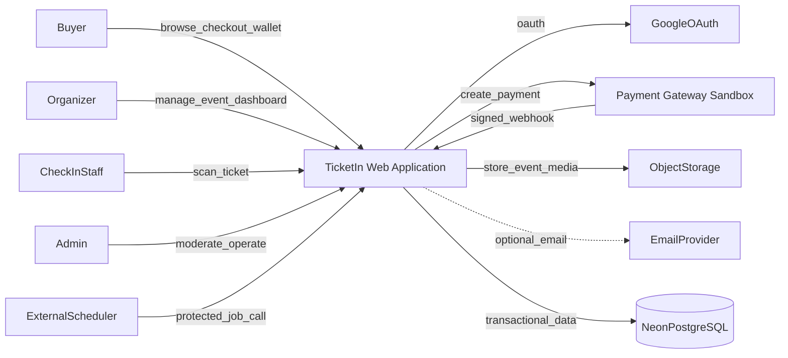
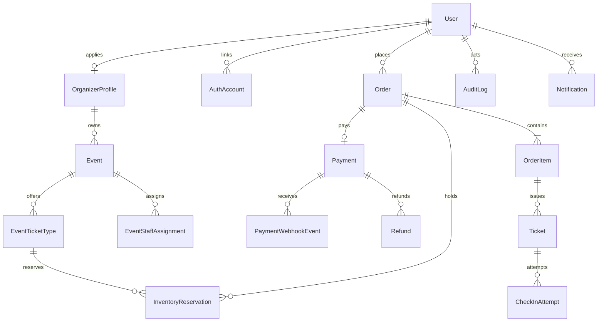
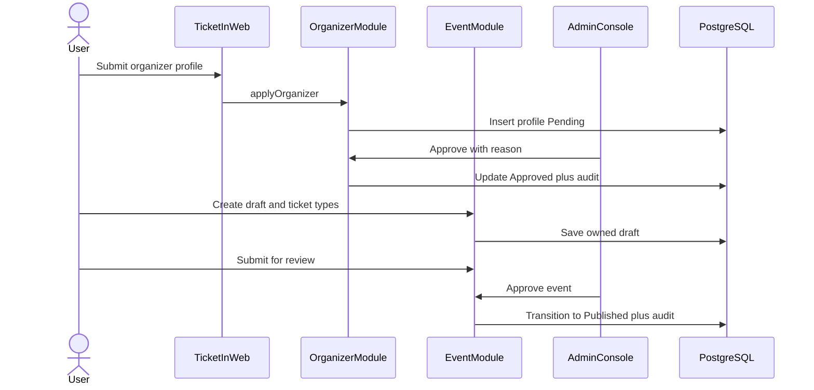
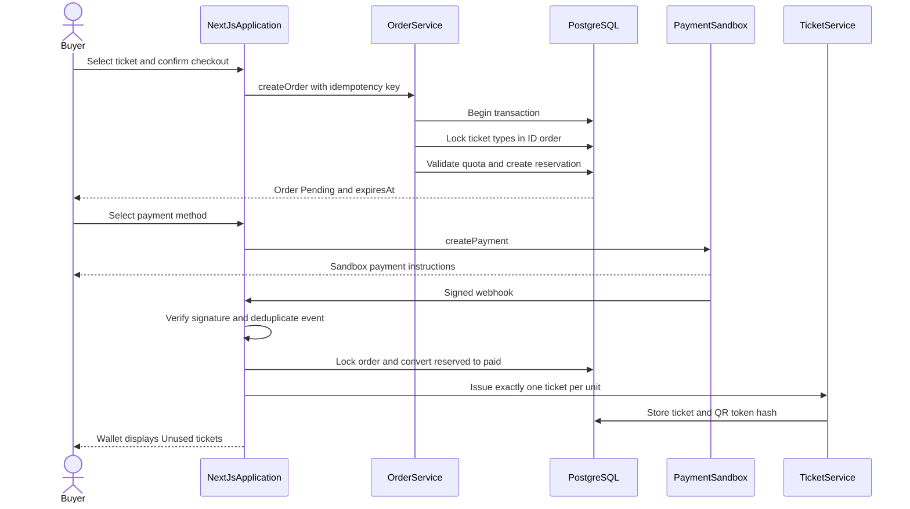
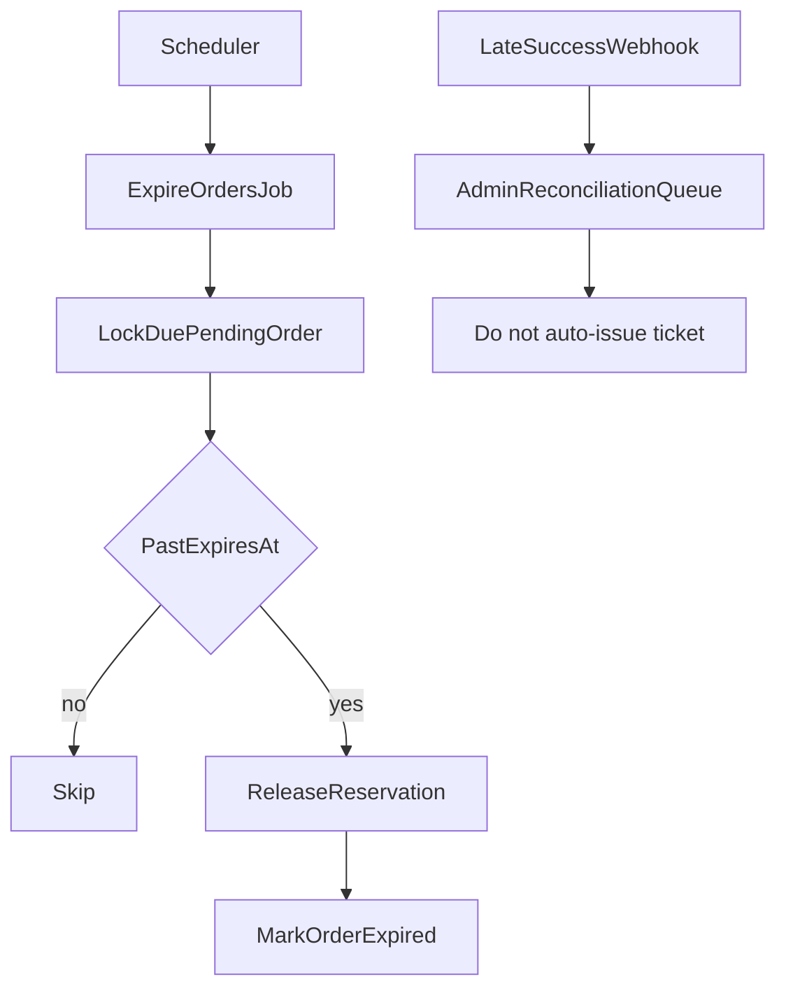
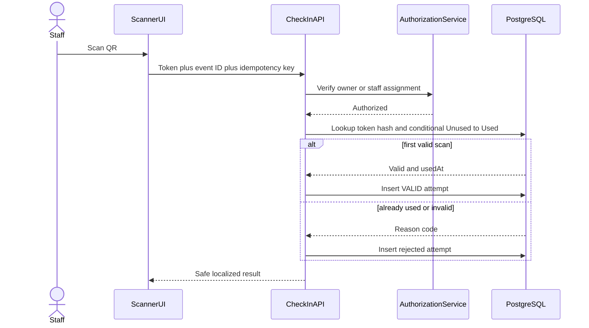
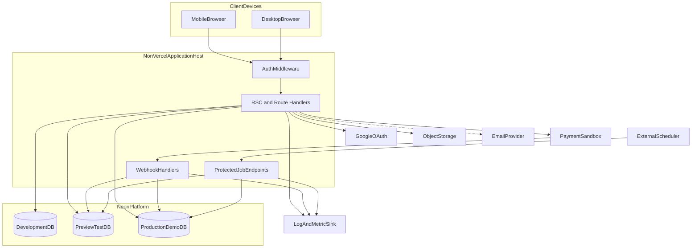

# Arsitektur Sistem TicketIn

| Atribut | Nilai |
|---|---|
| **Sistem** | TicketIn |
| **Versi dokumen** | 1.0 |
| **Status** | Arsitektur target MVP akademik |
| **Gaya arsitektur** | Modular monolith berbasis domain, serverless deployment |
| **Platform** | Aplikasi web responsif |
| **Pasar awal** | Indonesia, event tatap muka |
| **Model pembayaran MVP** | Payment gateway sandbox, tanpa uang nyata |
| **Target deployment** | Belum dipilih (TBD), non-Vercel |
| **Rencana implementasi** | RFC-001 sampai RFC-014 secara sekuensial |
| **Ekstensi komersial** | RFC-015 sampai RFC-020, status Deferred |

## 1. Pendahuluan dan Tujuan Sistem

### 1.1 Latar Belakang

TicketIn menyatukan proses pembuatan event, penjualan tiket, pembayaran, penerbitan e-ticket, dan check-in yang sebelumnya dapat tersebar di formulir, pesan pribadi, transfer manual, atau spreadsheet. Sistem ditujukan untuk empat kelompok pengguna:

- **Pembeli:** mencari event, melakukan checkout, dan menggunakan tiket.
- **Organizer:** membuat event, mengatur inventori, dan memantau penjualan.
- **Petugas check-in:** memvalidasi tiket di venue.
- **Admin:** memoderasi organizer/event dan menangani kasus operasional.

### 1.2 Tujuan Bisnis

1. Mengurangi rekap manual oleh organizer.
2. Memberikan status order dan tiket yang jelas kepada pembeli.
3. Mencegah overselling dan penggunaan tiket lebih dari satu kali.
4. Menyediakan jejak audit untuk tindakan sensitif.
5. Membuktikan kelayakan alur end-to-end melalui MVP akademik.

### 1.3 Tujuan Teknis

- Menjaga invariant transaksi melalui PostgreSQL dan transaksi atomik.
- Memisahkan domain dari framework serta layanan pihak ketiga.
- Memungkinkan pengujian setiap use case tanpa browser atau provider nyata.
- Menyediakan deployment yang stateless, terukur, dan dapat dipulihkan.
- Menjaga keamanan autentikasi, webhook, QR, dan data lintas organizer.

### 1.4 Ruang Lingkup Arsitektur

Dokumen ini mencakup arsitektur target untuk 61 fitur in-scope pada `features.md`. Detail implementasi terdapat di `RFC/RFC-001.md` sampai `RFC/RFC-014.md`.

Tidak termasuk:

- Uang nyata, settlement, payout, dan refund finansial produksi.
- Kursi bernomor, transfer/resale, voucher, dan dynamic pricing.
- Aplikasi mobile native, scanner offline, serta event online/hybrid.
- Multi-negara, multi-mata uang, dan microservices.

## 2. Batasan dan Asumsi

### 2.1 Batasan Produk

- MVP menggunakan Bahasa Indonesia dan Rupiah.
- Satu order hanya memuat tiket dari satu event.
- Reservasi kuota berlaku **15 menit**.
- Maksimal **5 tiket per jenis tiket per akun per event**.
- Satu unit order Paid menghasilkan satu tiket.
- Check-in memerlukan koneksi internet.
- Transaksi menggunakan data dan credential sandbox.

### 2.2 Batasan Proyek

- Horizon rencana adalah 12 minggu.
- Baseline kapasitas adalah satu full-stack engineer.
- Layanan diutamakan menggunakan free/academic tier.
- RFC dikerjakan ketat secara berurutan, tanpa implementasi paralel.
- Provider payment, object storage, scheduler, dan email belum seluruhnya dipilih.

### 2.3 Asumsi Infrastruktur

- Aplikasi **belum memiliki deployment aktif** dan provider hosting belum dipilih.
- Vercel bukan target deployment proyek ini.
- Provider terpilih harus mendukung Node.js 24, Next.js SSR/Route Handler, HTTPS, environment variable/secret, webhook publik, health check, dan deployment yang dapat di-rollback.
- Bentuk hosting dapat berupa container platform, PaaS Node.js, atau VPS dengan container; keputusan ditutup pada RFC-001.
- PostgreSQL dikelola oleh **Neon** dan setiap lingkungan menggunakan database/branch terisolasi.
- Scheduler bersifat eksternal; tidak menggunakan timer dalam proses serverless.
- Kamera perangkat dapat diakses melalui browser yang didukung.

### 2.4 Batas Kepatuhan

MVP akademik tidak membuktikan kesiapan komersial. Pilot dengan pengguna atau uang nyata memerlukan keputusan tambahan untuk UU PDP, KYC organizer, merchant of record, pajak, settlement, payout, refund, retensi data, SLA, dan incident response. Area tersebut telah dirancang awal dalam RFC-015–020, tetapi seluruhnya berstatus **Deferred** dan tidak mengizinkan aktivasi uang/data nyata.

## 3. Kondisi Saat Ini dan Arsitektur Target

### 3.1 Kondisi Prototype

Kode saat ini adalah prototype autentikasi:

- Next.js 14, React 18, TypeScript 5, dan Tailwind CSS 3.
- Login username/kata sandi serta Google melalui NextAuth.
- Raw SQL melalui `@neondatabase/serverless`.
- Prisma schema hanya memuat `User` dan belum menjadi persistence runtime.
- Konfigurasi URL autentikasi masih membaca environment khusus Vercel dan harus dibuat provider-neutral pada RFC-001.
- Terdapat runtime DDL, fallback JSON, seed account di request path, ID berbasis waktu, serta fallback secret.
- Belum ada module event, order, payment, ticket, check-in, test suite, atau CI.

Kondisi tersebut bukan arsitektur akhir. RFC-001 dan RFC-002 wajib menyelesaikan migrasi serta risiko keamanan sebelum domain baru dibangun.

### 3.2 Arsitektur Target

TicketIn menggunakan **modular monolith berbasis domain**:

- Seluruh domain berjalan dalam satu deployment aplikasi.
- Module mempunyai boundary dan API internal yang jelas.
- Data disimpan pada satu PostgreSQL.
- Komunikasi antar-module berlangsung melalui application service dan kontrak internal.
- Integrasi eksternal dibungkus dengan port/adapter.
- Transaksi lintas entitas penting tetap dapat dilakukan secara atomik.

### 3.3 Alasan Memilih Modular Monolith

| Pertimbangan | Alasan |
|---|---|
| **Ukuran tim** | Satu engineer lebih mudah mengembangkan dan mengoperasikan satu aplikasi |
| **Timeline** | Tidak membutuhkan service discovery, distributed tracing, atau deployment banyak layanan |
| **Konsistensi data** | Inventori, payment, ticket, dan check-in membutuhkan transaksi kuat |
| **Pengujian** | Use case dapat diuji melalui service tanpa jaringan antar-service |
| **Biaya** | Cocok dengan free/academic tier |
| **Evolusi** | Boundary domain tetap memungkinkan ekstraksi service jika skala masa depan membutuhkannya |

Microservices tidak direkomendasikan pada MVP karena menambah distributed transaction, latency, operasional, dan failure mode tanpa manfaat yang sebanding.

## 4. Prinsip Arsitektur

1. **PostgreSQL adalah source of truth.**
2. **Invariant dijaga database dan transaction**, bukan hanya UI.
3. **Server Components menjadi default**; Client Components hanya untuk interaksi browser.
4. **Route Handler dan UI harus tipis**; aturan bisnis berada di application/domain service.
5. **Dependency mengarah ke dalam:** presentation → application → domain.
6. **SDK provider hanya berada di adapter.**
7. **Payment dan check-in tidak menggunakan optimistic update.**
8. **Semua aksi sensitif memiliki authorization dan audit.**
9. **Tidak ada fallback diam-diam** untuk database, secret, auth, atau payment.
10. **Observability tidak boleh membocorkan PII, secret, atau token QR.**
11. **Major upgrade dipisahkan dari perubahan fitur.**
12. **Fitur Won’t Have tidak diimplementasikan tanpa perubahan scope.**

## 5. Diagram Konteks Sistem



Trust boundary:

- Browser, Google, payment gateway, scheduler, storage, dan email dianggap eksternal.
- Semua input eksternal harus diotentikasi atau divalidasi.
- Database hanya diakses oleh server melalui repository.

## 6. Komponen Utama Sistem

| Komponen | Fungsi |
|---|---|
| **Public Web** | Katalog, pencarian, filter, dan detail event |
| **Buyer Experience** | Checkout, status payment, order history, dan ticket wallet |
| **Organizer Workspace** | Pengajuan organizer, event authoring, ticket type, dan dashboard |
| **Admin Console** | Moderasi, rekonsiliasi, refund sandbox, pencarian, dan audit |
| **Check-in UI** | Kamera scanner, validasi QR, input manual, dan hasil scan |
| **Application Services** | Orkestrasi use case dan transaction boundary |
| **Domain Modules** | Invariant, status transition, dan aturan bisnis |
| **Repositories** | Persistence melalui Prisma/PostgreSQL |
| **Provider Adapters** | Payment, storage, email, analytics, dan scheduler |
| **Platform Services** | Env validation, logger, error mapping, security, health, dan format lokal |

## 7. Arsitektur Komponen Internal

### 7.1 Dependency Layers


`Domain` tidak mengimpor React, Next.js, Prisma, atau SDK provider. Infrastructure mengimplementasikan interface yang didefinisikan oleh module/application.

### 7.2 Module Map

| Module | Tanggung Jawab | RFC |
|---|---|---|
| `platform` | Env, DB client, errors, logger, health, locale | RFC-001, RFC-014 |
| `auth` | Registrasi, login, OAuth, session, RBAC | RFC-002, RFC-013 |
| `audit` | Append-only audit dan event analytics | RFC-003 |
| `organizers` | Profil organizer dan moderasi | RFC-004 |
| `events` | Authoring, ticket type, lifecycle, staff | RFC-005–006 |
| `catalog` | Discovery dan projection event Published | RFC-007 |
| `inventory` | Availability, counter, reservation release | RFC-008 |
| `orders` | Checkout, item snapshot, idempotency, expiry | RFC-008 |
| `payments` | Adapter sandbox, webhook inbox, reconciliation | RFC-009 |
| `refunds` | Lifecycle refund sandbox | RFC-009 |
| `tickets` | Issuance, QR token, buyer wallet | RFC-010 |
| `check-in` | Scanner API, atomic use, attempt log | RFC-011 |
| `reporting` | Organizer/admin dashboard dan export | RFC-012 |
| `notifications` | In-app, email optional, reminder | RFC-013 |

### 7.3 Struktur Folder Target

```text
app/
  (public)/
  (buyer)/
  organizer/
  admin/
  api/
    webhooks/
    internal/jobs/
components/
  ui/
  shared/
modules/
  auth/
  audit/
  organizers/
  events/
  catalog/
  inventory/
  orders/
  payments/
  refunds/
  tickets/
  check-in/
  reporting/
  notifications/
lib/
  db/
  env/
  errors/
  logger/
  security/
prisma/
  schema.prisma
  migrations/
tests/
  integration/
  e2e/
```

Setiap module dapat memiliki:

```text
domain/          # entity, value object, policy, state transition
application/     # command/query service dan port
infrastructure/  # Prisma repository dan provider adapter
ui/              # komponen yang hanya dimiliki module
```

Folder hanya dibuat jika berisi implementasi nyata; hindari abstraksi kosong.

## 8. Tech Stack

Versi target mengikuti `RULES.md` dan diverifikasi pada 7 September 2026.

| Area | Teknologi | Versi Target | Alasan |
|---|---|---:|---|
| Runtime | Node.js Active LTS | 24.20.0 | Dukungan LTS dan runtime server |
| Package manager | npm | 12.0.2 | Lockfile deterministik |
| Framework | Next.js App Router | 16.3.4 | RSC, routing, Route Handler, deployment terkelola |
| UI | React / React DOM | 19.2.8 | Komponen dan Server Components |
| Bahasa | TypeScript | 7.0.2 | Type safety dan refactoring |
| Styling | Tailwind CSS | 4.3.3 | Sistem desain responsif |
| Database | PostgreSQL pada Neon | Terkelola | ACID, transaction, constraint, branch per environment |
| ORM | Prisma ORM/Client | 7.10.0 | Typed access dan migration terversi |
| DB driver | `@neondatabase/serverless` | 1.1.0 | Konektivitas Neon serverless |
| Auth | NextAuth | 4.24.15 | Credentials, Google OAuth, dan session |
| Validation | Zod | 4.5.4 | Boundary validation dan typed env |
| Hashing | `bcryptjs` | 3.0.3 | Adaptive password hashing |
| QR generation | `qrcode` | 1.5.4 | Render QR e-ticket |
| QR scanning | `@zxing/browser` | 0.2.1 | Camera decoding pada browser |
| Logging | Pino | 10.3.1 | Structured JSON log |
| Unit/integration | Vitest | 5.0.0 | Test cepat dan TypeScript-friendly |
| E2E | Playwright | 1.63.0 | Browser dan mobile viewport testing |
| Lint/format | ESLint / Prettier | 10.10.0 / 3.9.6 | Konsistensi dan quality gate |
| Hosting | Provider non-Vercel — TBD pada RFC-001 | TBD | Wajib mendukung Node.js/Next.js penuh, HTTPS, webhook, health check, secret, dan rollback |

Prisma 8 prerelease tidak digunakan. Upgrade dari stack prototype dilakukan sebagai compatibility migration pada RFC-001, bukan bersamaan dengan fitur domain.

## 9. Model Domain dan Data

### 9.1 Hubungan Entitas



### 9.2 Entitas Utama

| Entitas | Tanggung Jawab Data |
|---|---|
| `User` | Identitas global dan status akun |
| `AuthAccount` | Hubungan provider OAuth yang aman |
| `OrganizerProfile` | Capability organizer dan status moderasi |
| `Event` | Detail, owner, venue, waktu, dan lifecycle |
| `EventTicketType` | Harga, kuota, jadwal jual, dan counter |
| `Order` | Buyer, status, expiry, total, dan nomor order |
| `OrderItem` | Snapshot tiket, harga, dan kuantitas |
| `InventoryReservation` | Kuota aktif per order sampai expiry/release |
| `Payment` | Provider reference, metode, nominal, dan status |
| `PaymentWebhookEvent` | Inbox idempoten untuk event provider |
| `Refund` | Lifecycle refund sandbox |
| `Ticket` | Unit fulfillment, token QR hash, dan status |
| `CheckInAttempt` | Hasil setiap percobaan validasi |
| `AuditLog` | Jejak perubahan sensitif yang append-only |
| `Notification` | Pesan in-app/email dan delivery status |

### 9.3 Status Canonical

| Entitas | Status |
|---|---|
| Organizer | Pending, Approved, Rejected, Suspended |
| Event | Draft, PendingReview, Published, Rejected, Cancelled, Completed |
| Order | Pending, Paid, Failed, Expired, Cancelled, Refunded |
| Payment | Created, Pending, Succeeded, Failed, Expired, Refunded |
| Ticket | Unused, Used, Cancelled |
| Refund | Requested, Approved, Rejected, Processing, Completed, Failed |

Reservasi bukan status Ticket. Ticket baru dibuat setelah Order Paid.

### 9.4 Invariant Data

1. `paidQuantity + reservedQuantity <= quota`.
2. Nilai counter tidak boleh negatif.
3. Satu external payment reference hanya terkait satu Payment.
4. Satu provider webhook event diproses efektif satu kali.
5. Satu unit OrderItem Paid menghasilkan tepat satu Ticket.
6. Satu Ticket memiliki paling banyak satu check-in berhasil.
7. Event Cancelled tidak kembali Published.
8. Organizer hanya membaca data event miliknya.

Invariant dilindungi melalui transaction, foreign key, unique/check constraint, dan conditional update.

### 9.5 Konvensi Penyimpanan

- ID menggunakan CUID/UUID non-predictable.
- Uang disimpan sebagai integer Rupiah.
- Waktu disimpan sebagai `TIMESTAMPTZ`/UTC.
- Prisma memetakan nama aplikasi camelCase ke database snake_case.
- OrderItem menyimpan snapshot agar perubahan harga tidak mengubah transaksi lama.
- Transaksi, ticket, audit, dan check-in tidak di-hard-delete.
- Skema hanya berubah melalui migration; runtime DDL dilarang.

## 10. Alur Data Utama

### 10.1 Publikasi Event



### 10.2 Checkout sampai Penerbitan Tiket



Transaction payment harus mengikuti lock order:

1. Lock Order.
2. Lock seluruh EventTicketType berdasarkan ID ascending.
3. Validasi Order masih Pending dan belum melewati cutoff.
4. Kurangi `reservedQuantity`, tambah `paidQuantity`.
5. Ubah Order/Payment.
6. Terbitkan Ticket.
7. Tulis audit/outbox dalam transaction yang sama.

### 10.3 Expiry dan Webhook Terlambat



Job menggunakan waktu database, batch, dan `SKIP LOCKED`. Job harus aman dijalankan ulang. Webhook sukses setelah expiry tidak menghidupkan reservasi lama karena kuota mungkin sudah terjual.

### 10.4 Check-in



Kehilangan koneksi tidak mengubah Ticket secara lokal. Dua scan bersamaan hanya boleh menghasilkan satu transisi berhasil.

## 11. Kontrak API dan Boundary

### 11.1 Pola API

- Route Handler memvalidasi input dengan Zod.
- Session, role, capability, dan ownership diperiksa sebelum service dipanggil.
- Application service mengembalikan typed result/error.
- Error mapper menghasilkan envelope konsisten.
- List menggunakan cursor/page pagination.
- Mutasi kritis menerima idempotency key bila diperlukan.

Contoh error:

```json
{
  "error": {
    "code": "INVENTORY_UNAVAILABLE",
    "message": "Jumlah tiket yang tersedia tidak mencukupi.",
    "correlationId": "req_...",
    "fieldErrors": {}
  }
}
```

### 11.2 Kelompok Endpoint

| Area | Endpoint Representatif | Akses |
|---|---|---|
| Auth | `/api/register`, `/api/auth/*` | Publik/session |
| Organizer | `/api/organizers/application`, `/api/admin/organizers/*` | User/Admin |
| Event | `/api/organizer/events/*`, `/api/admin/events/*` | Organizer/Admin |
| Catalog | `/api/events`, `/api/events/:slug` | Publik |
| Order | `/api/orders`, `/api/orders/:id` | Pembeli pemilik |
| Payment | `/api/orders/:id/payment`, `/api/webhooks/payment` | Pembeli/Provider |
| Ticket | `/api/tickets/:id`, `/api/tickets/:id/qr` | Pemilik |
| Check-in | `/api/events/:id/check-ins` | Owner/Petugas |
| Dashboard | `/api/organizer/reports/*`, `/api/admin/operations/*` | Organizer/Admin |
| Jobs | `/api/internal/jobs/expire-orders` | Signed scheduler |
| Health | `/api/health/live`, `/api/health/ready` | Infrastruktur |

Kontrak rinci, field, kode error, dan response terdapat pada RFC pemilik endpoint.

## 12. Manajemen State dan Caching

### 12.1 State

| State | Source of Truth |
|---|---|
| Search/filter/pagination/tab | URL query parameter |
| Form sementara | React local state |
| Session/identity | NextAuth server session |
| Event/order/payment/ticket | PostgreSQL |
| Inventory availability | PostgreSQL transaction/counter |
| Scanner camera state | Client Component lokal |
| Provider delivery state | Provider adapter plus persisted inbox/outbox |

Global client state library tidak diperlukan untuk MVP. Tambahkan hanya jika kebutuhan lintas halaman tidak dapat ditangani oleh server state dan URL.

### 12.2 Caching

- Katalog dan detail Published dapat memakai bounded revalidation.
- Perubahan event harus menginvalidasi cache terkait.
- Inventory, order, payment, refund, QR validation, dan check-in tidak boleh memakai cache sebagai source of truth.
- Response QR dan halaman ticket tidak boleh public-cache.
- Dashboard memakai query terindeks dan pagination; materialized aggregate belum diperlukan pada MVP.

## 13. Integrasi Pihak Ketiga

| Integrasi | Port/Adapter | Status | Fallback |
|---|---|---|---|
| Neon/PostgreSQL | Prisma Repository | Dipilih | Tidak ada fallback file |
| Google OAuth | NextAuth Provider | Digunakan prototype | Credentials login |
| Payment | `PaymentGateway` | TBD sebelum RFC-009 | Deterministic fake untuk test |
| Object storage | `ObjectStorage` | TBD sebelum RFC-005 | Placeholder gambar |
| Scheduler | `JobScheduler`/signed endpoint | TBD sebelum RFC-008 | Manual trigger hanya untuk test |
| Email | `EmailProvider` | Opsional sebelum RFC-013 | In-app notification |
| QR generator | `QrRenderer` | Direncanakan | Tidak ada QR sebelum RFC-010 |
| QR scanner | Browser adapter | Direncanakan | Input kode manual sebagai Should Have |

Aturan adapter:

- SDK provider tidak boleh diimpor oleh domain.
- Provider status dipetakan ke status canonical.
- Timeout, retry, dan idempotensi didefinisikan per operasi.
- Fake deterministic tersedia untuk automated test.
- SDK tidak dipasang sebelum decision gate disetujui.

## 14. Deployment dan Infrastruktur

TicketIn **belum di-deploy**. Diagram berikut adalah topologi target yang bersifat provider-neutral, bukan representasi lingkungan yang sudah tersedia. Pemilihan antara container platform, PaaS Node.js, atau VPS/container dilakukan melalui decision gate RFC-001.

### 14.1 Topologi Deployment



Diagram menunjukkan deployment logis. Satu instance runtime hanya terhubung ke database sesuai environment, bukan ketiga database sekaligus.

### 14.2 Lingkungan

| Lingkungan | Tujuan | Data | Integrasi |
|---|---|---|---|
| Development | Pengembangan lokal | Seed eksplisit | Fake/sandbox |
| Preview/Test | Integration, E2E, UAT, load test | Data uji terisolasi | Sandbox publik |
| Production Demo | Demo akademik | Data uji terkontrol | Sandbox |

Environment variable tervalidasi saat startup. Secret tidak memiliki fallback. `.env.example` hanya berisi placeholder aman.

### 14.3 Persyaratan Provider Hosting

Provider yang dipilih wajib menyediakan:

- Runtime Node.js 24 dan dukungan penuh untuk Next.js SSR serta Route Handler.
- Domain HTTPS dan endpoint publik untuk OAuth callback serta payment webhook.
- Secret/environment variable terenkripsi dan terpisah per lingkungan.
- Health check, structured log, serta akses terhadap metrik dasar.
- Deployment immutable atau versioned dengan rollback yang terdokumentasi.
- Kemampuan menjalankan migration sebagai release step.
- Konektivitas aman ke Neon PostgreSQL dan object storage terpilih.
- Dukungan scheduler bawaan atau integrasi dengan scheduler eksternal.

Jika menggunakan VPS/container, tim juga bertanggung jawab atas reverse proxy, TLS renewal, process/container supervision, patching OS, firewall, backup konfigurasi, dan monitoring host. Jika menggunakan PaaS/container platform, kemampuan tersebut harus diverifikasi terhadap batas runtime, cold start, request timeout, dan biaya.

### 14.4 CI/CD

Pipeline minimum:

1. Install dari lockfile.
2. Format/lint.
3. Typecheck.
4. Unit dan integration test.
5. Migration status/drift check.
6. Dependency/security scan.
7. Build immutable artifact.
8. Deploy preview dan jalankan E2E/smoke test.
9. Approval untuk production demo.
10. Deploy artifact yang sama dan jalankan post-deploy smoke test.

Rollback mengembalikan artifact sebelumnya. Migrasi mengikuti expand → backfill → contract agar minimal satu versi aplikasi tetap kompatibel.

## 15. Keamanan

### 15.1 Autentikasi dan Session

- NextAuth mengelola credentials dan Google OAuth.
- Cookie session menggunakan `HttpOnly`, `Secure`, dan SameSite yang sesuai.
- Secret wajib tersedia dan aplikasi fail-fast jika hilang.
- Dangerous automatic email account linking dinonaktifkan.
- Password di-hash asynchronous dengan adaptive cost.
- Rate limit diterapkan pada login, register, reset, checkout, scanner, dan webhook.
- Session revocation menggunakan versi/auth state yang dapat divalidasi server.

### 15.2 Otorisasi

- Role global minimal adalah User dan Admin.
- Organizer adalah capability dari `OrganizerProfile Approved`, bukan role client.
- Petugas mendapat assignment per event.
- Route, service, dan query memeriksa role serta object ownership.
- Akses objek organisasi lain mengembalikan response aman tanpa membocorkan keberadaan data.

### 15.3 Payment dan Webhook

- Hanya credential sandbox.
- Signature diverifikasi dari raw request sesuai provider.
- Provider event ID unik mencegah replay.
- Redirect browser tidak dapat menetapkan Paid.
- Callback terlambat masuk rekonsiliasi, tidak menerbitkan tiket.
- Secret dan payload sensitif disensor dari log.

### 15.4 QR dan Check-in

- Token acak direkomendasikan 256-bit dan minimum 128-bit.
- QR tidak memuat PII.
- Database menyimpan token hash jika memungkinkan.
- Validasi dilakukan server setelah authorization.
- Conditional update menjamin satu penggunaan.
- Attempt log tidak menyimpan token mentah.

### 15.5 Data dan Kepatuhan

- Terapkan data minimization dan least privilege.
- Organizer hanya melihat data minimum peserta event sendiri.
- Audit log menyimpan metadata aman, bukan secret.
- Backup dan log mempunyai akses terbatas.
- Retensi, penghapusan, consent, dan kebijakan privasi wajib diputuskan sebelum data nyata.

## 16. Skalabilitas dan Kinerja

### 16.1 Profil Uji MVP

- 5.000 tiket per event.
- 50 pembeli checkout bersamaan.
- 10 scanner bersamaan.
- Load test minimal 15 menit.

Target:

- Katalog/detail server response p95 ≤ 2 detik.
- Check-in p95 ≤ 1,5 detik.
- Overselling = 0.
- Check-in berhasil ganda = 0.

### 16.2 Strategi Skalabilitas

- Runtime aplikasi stateless sehingga dapat scale horizontal.
- Semua state transaksional berada di PostgreSQL.
- Gunakan pooled/serverless-compatible connection.
- Query memilih kolom eksplisit dan menggunakan pagination.
- Indeks mengikuti query aktual: event status/slug, owner, order expiry, payment external reference, ticket token hash, dan check-in.
- Expiry diproses dalam batch dengan `FOR UPDATE SKIP LOCKED`.
- Webhook inbox dan job bersifat idempoten.
- Public catalog dapat di-cache; state transaksi tidak.

### 16.3 Batas Skalabilitas

Modular monolith cukup untuk MVP. Ekstraksi service baru dipertimbangkan jika bukti produksi menunjukkan kebutuhan independensi scaling, ownership tim, atau isolasi failure. Kandidat pertama secara teoritis adalah notifications atau reporting, bukan inventory/payment yang membutuhkan konsistensi kuat.

## 17. Reliability, Error Handling, dan Observability

### 17.1 Reliability

- Backup database memenuhi baseline RPO 24 jam.
- Restore drill dilakukan sebelum rilis.
- Webhook, expiry job, dan notification delivery dapat di-retry dengan aman.
- Kegagalan provider tidak boleh menghasilkan transaksi lokal setengah selesai.
- Health endpoint dipisahkan menjadi liveness dan readiness.

### 17.2 Error Handling

Kategori canonical:

- `VALIDATION`
- `AUTHENTICATION`
- `AUTHORIZATION`
- `NOT_FOUND`
- `CONFLICT`
- `RATE_LIMIT`
- `PROVIDER`
- `NETWORK_CLIENT`
- `INTERNAL`

Pesan pengguna memakai Bahasa Indonesia. Error code memakai identifier Inggris yang stabil. Stack trace dan detail internal tidak dikirim ke client.

### 17.3 Logging dan Monitoring

Structured log minimal memuat timestamp, level, correlation ID, module, operation, outcome, dan duration.

Monitor:

- Error rate aplikasi.
- Webhook invalid, duplikat, atau terlambat.
- Expiry job gagal/tertunda.
- Konflik reservasi.
- Latensi p95 check-in.
- Rejected check-in menurut reason code.
- Kesehatan aplikasi/database.

Jangan log password, cookie, OAuth token, database URL, raw QR token, atau PII yang tidak diperlukan.

## 18. Aksesibilitas, Responsif, dan Lokalisasi

- Target WCAG 2.1 AA pada alur utama.
- Gunakan semantic HTML, keyboard navigation, focus state, label, dan error terkait field.
- Hasil scanner tidak dibedakan dengan warna saja.
- Hormati reduced motion.
- Optimalkan buyer wallet dan scanner untuk mobile.
- Dukung dua versi terbaru Chrome, Edge, Firefox, dan Safari.
- Scanner wajib diuji pada Chrome Android.
- Harga menggunakan integer Rupiah dan formatter `id-ID`.
- Waktu ditampilkan sesuai zona waktu event.

## 19. Keputusan Arsitektur Utama

| ID | Keputusan | Status | Konsekuensi |
|---|---|---|---|
| ADR-001 | Modular monolith | Diterima | Operasi sederhana; boundary module wajib dijaga |
| ADR-002 | PostgreSQL/Neon sebagai satu source of truth | Diterima | Tidak ada JSON fallback |
| ADR-003 | Prisma migration dan repository | Diterima | Runtime DDL/raw SQL umum dihentikan |
| ADR-004 | Next.js App Router dan RSC default | Diterima | Client Component dibatasi pada interaksi |
| ADR-005 | Provider port/adapter | Diterima | SDK dapat diganti dan diuji dengan fake |
| ADR-006 | Payment sandbox-only | Diterima | Tidak ada payout/refund uang nyata |
| ADR-007 | Inventory counter plus reservation record | Diterima | Membutuhkan transaction/locking |
| ADR-008 | Ticket dibuat setelah Paid | Diterima | Reservation bukan Ticket |
| ADR-009 | QR opaque dan server-validated | Diterima | Membutuhkan lookup hash dan koneksi |
| ADR-010 | Check-in online dan atomik | Diterima | Offline scan ditunda |
| ADR-011 | Deployment provider-neutral dan stateless | Diterima | Provider non-Vercel dipilih pada RFC-001; scheduler tidak boleh bergantung pada timer proses |
| ADR-012 | Strict sequential RFC delivery | Diterima | RFC berikutnya menunggu exit criteria |
| ADR-013 | Ekstensi komersial dipisahkan dan Deferred | Diterima | RFC-015–020 tidak aktif sampai Commercial Entry Gate disetujui |

## 20. Roadmap Implementasi Arsitektur

```mermaid
flowchart LR
  R1["RFC-001 Platform"] --> R2["RFC-002 Auth/RBAC"]
  R2 --> R3["RFC-003 Audit"]
  R3 --> R4["RFC-004 Organizer"]
  R4 --> R5["RFC-005 EventAuthoring"]
  R5 --> R6["RFC-006 EventLifecycle"]
  R6 --> R7["RFC-007 Catalog"]
  R7 --> R8["RFC-008 Order/Inventory"]
  R8 --> R9["RFC-009 Payment"]
  R9 --> R10["RFC-010 Ticket/QR"]
  R10 --> R11["RFC-011 CheckIn"]
  R11 --> R12["RFC-012 Dashboard"]
  R12 --> R13["RFC-013 Notification"]
  R13 --> R14["RFC-014 Hardening"]
  R14 --> UAT["UAT and Academic Release"]
  UAT --> CEG{"Commercial Entry Gate"}
  CEG -->|approved| R15["RFC-015 Legal/Privacy/KYC"]
  R15 --> R16["RFC-016 ProductionPayment/Ledger"]
  R16 --> R17["RFC-017 Settlement/Payout"]
  R17 --> R18["RFC-018 Refund/Dispute"]
  R18 --> R19["RFC-019 Security/Fraud"]
  R19 --> R20["RFC-020 Reliability/Launch"]
  R20 --> GA["Commercial General Availability"]
  CEG -->|not_approved| Deferred["Remain Deferred"]
```



RFC-001–014 adalah jalur aktif MVP akademik. RFC-015–020 merupakan jalur kondisional: masing-masing bergantung pada seluruh RFC sebelumnya, UAT akademik, dan Commercial Entry Gate. Detail dependency dan exit criteria terdapat pada `RFC/RFCS.md`.

### 20.1 Ekstensi Komersial Deferred

| RFC | Fokus | Aktivasi |
|---|---|---|
| RFC-015 | Legal, privasi, hak subjek data, dan KYC/KYB | Setelah Commercial Entry Gate |
| RFC-016 | Production payment dan immutable financial ledger | Dark mode; live charge tetap dilarang |
| RFC-017 | Settlement, payout, hold, dan reconciliation | Live payout tetap dilarang |
| RFC-018 | Refund produksi, chargeback, dispute, dan evidence | Provider production tetap nonaktif |
| RFC-019 | MFA, fraud prevention, pentest, dan incident response | Wajib lulus sebelum launch |
| RFC-020 | SLO/SLA, DR, support, progressive rollout, dan launch gate | Satu-satunya RFC yang dapat mengizinkan live traffic |

Pembuatan RFC tersebut hanya menyediakan desain agar proyek dapat berkembang tanpa merombak domain utama. F63, F64, dan F73 tetap Won’t Have pada MVP sampai prioritas produk diubah secara eksplisit.

## 21. Risiko Arsitektur

| Risiko | Dampak | Mitigasi |
|---|---|---|
| Upgrade stack mematahkan auth/build | Seluruh roadmap terblokir | Compatibility spike pada RFC-001 |
| Raw SQL/runtime DDL berbeda dari schema | Drift dan kehilangan data | Prisma migration sebagai satu jalur |
| OAuth linking tidak aman | Account takeover | Explicit safe linking pada RFC-002 |
| Race pada tiket terakhir | Overselling | Lock terurut, counter, constraint, concurrent test |
| Webhook duplikat/terlambat | Status/tiket ganda | Inbox unik, idempotensi, reconciliation |
| QR dibagikan atau dipindai bersamaan | Akses tidak sah | Token aman dan conditional update |
| Scheduler tidak andal | Kuota tertahan | External scheduler, retry, health metric |
| Provider belum dipilih | RFC terkait terblokir | Tutup decision gate sebelum RFC |
| Koneksi venue buruk | Antrean check-in | Pesan network jelas dan input manual; offline di luar MVP |
| Scope terlalu besar | Keterlambatan | Must Have dulu; potong Should/Could |
| RFC komersial dijalankan tanpa strategi | Risiko hukum/finansial | Pertahankan status Deferred dan wajibkan Commercial Entry Gate |
| Credential produksi aktif terlalu dini | Transaksi nyata tak terkendali | Dark mode RFC-016–019; aktivasi hanya melalui RFC-020 |

## 22. Decision Gates Terbuka

| Batas Waktu | Keputusan |
|---|---|
| RFC-001 | Provider hosting non-Vercel, model deployment (container/PaaS/VPS), strategi migrasi/reset data prototype, dan hasil compatibility spike |
| RFC-005 | Provider object storage atau placeholder |
| RFC-008 | Provider scheduler/cron |
| RFC-009 | Payment gateway sandbox dan kontrak webhook |
| RFC-013 | Email provider atau in-app-only |
| Sebelum RFC-015 | Commercial Entry Gate, strategi komersial, owner legal/finance/security/operations, anggaran, dan timeline |
| RFC-015–019 | Seluruh keputusan legal, payment, payout, refund, fraud, dan readiness tetap tanpa live traffic |
| RFC-020 | Persetujuan Commercial GA, live credential, progressive rollout, rollback, dan kill switch |

Decision gate tidak boleh diselesaikan dengan menambah SDK secara sepihak. Keputusan harus dicatat sebagai ADR atau pembaruan RFC.

## 23. Panduan Developer Baru

1. Baca `prd-improved.md`, `features.md`, dan `RULES.md`.
2. Buka `RFC/RFCS.md` untuk mengetahui posisi implementasi.
3. Kerjakan hanya RFC aktif dan jangan mengimplementasikan kebutuhan RFC mendatang.
4. Ikuti dependency presentation → application → domain → ports.
5. Gunakan Prisma/PostgreSQL dan migration; jangan menambah fallback file.
6. Tambahkan test yang menautkan ID fitur.
7. Jalankan lint, typecheck, test, migration check, dan build sebelum menyatakan selesai.
8. Catat asumsi atau keputusan arsitektur yang berubah.
9. Jangan menjalankan RFC-015–020 selama Commercial Entry Gate belum disetujui.

## 24. Referensi

- `prd-improved.md` — sumber kebutuhan produk utama.
- `features.md` — daftar fitur, prioritas, acceptance criteria, dan dependensi.
- `RULES.md` — standar pengembangan dan AI assistance.
- `RFC/RFCS.md` — roadmap implementasi sekuensial.
- `RFC/RFC-001.md` sampai `RFC/RFC-014.md` — spesifikasi aktif MVP akademik.
- `RFC/RFC-015.md` sampai `RFC/RFC-020.md` — rancangan komersial Deferred.
- `PRD.md` — dokumen awal dan konteks historis.
